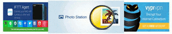

## <u>Description</u>

**HideThatBanner** performs a modification to the QTS App Center to hide the animated banner at the top of store pages.

Yes, *this* rather distracting and annoying thing will be hidden:

## <u>How to install</u>

- It's available in the [Qnapclub Store!](https://qnapclub.eu/en/qpkg/560)

- After installation, force-reload the App Center (I think CTRL+F5 is the usual key combo). You may also need to clear your browser cache.

- [Click here](https://qnapclub.eu/en/howto/1) to learn how to add the **Qnapclub Store** as an App Center repository in QTS.

## <u>Notes</u>

- It's only been tested on QTS 4.2.6. Please advise if it works on other firmwares. If it doesn't, and you'd like to help make it so, please post in the forum topic and we'll work it out.

- This was first discussed [here](https://forum.qnap.com/viewtopic.php?f=11&t=139526).

- This package’s [source](url=https://github.com/OneCDOnly/HideThatBanner) is available on GitHub.

- [Changelog](https://raw.githubusercontent.com/OneCDOnly/HideThatBanner/master/changelog.txt)